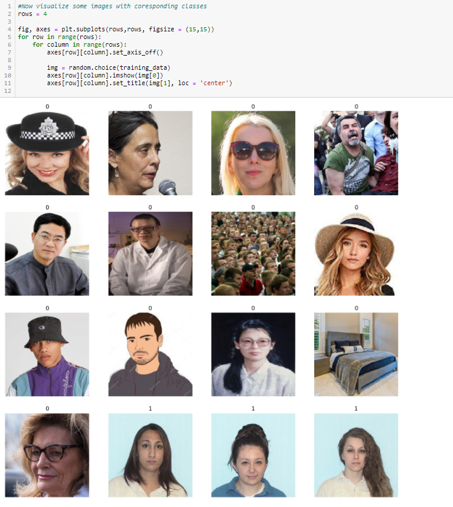
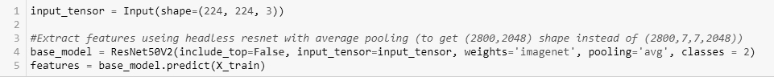
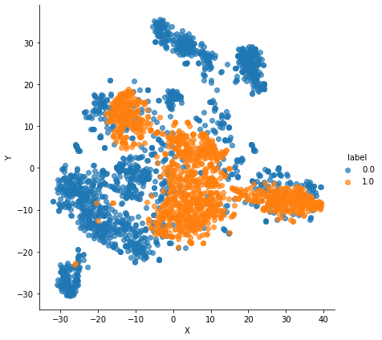
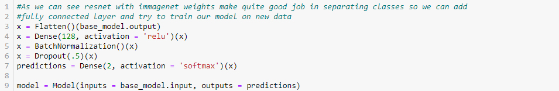
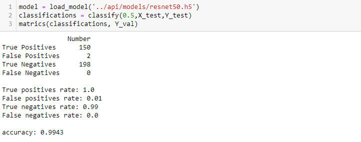

# Formal Photo Verification App 

This easy web application predicts whether the photo is in a formal style.  
APP: https://share.streamlit.io/liljack118/formal-photo-verification/app/app.py  
API: https://formal-photo-verification-api.herokuapp.com/

## Data 
To train network I used dataset of 3500 images in total.  
Training set - 2800 images ( 1200 positive / 1600 negative)  
Validation set - 350 images (150 positive / 200 negative) 
Test set - 350 images (150 positive / 200 negative)  

Invalid images contains:
- rotated head 
- frontal head photos with sunglasses/hats/headset/unnatural mimic
- frontal head photos on wrong background
- animated frontal head photos
- empty rooms photos
- person with body 
 
Invalid images from every subfolder were distributed equally to training,validation and test set to make sure that images in every set came from same distribution.

## Model
To make predictions I used ResNet50 network with imagenet weights. Firstly i extracted features (that will be feeded to fully connected layers) of headless model and then visualize them with t-sne to see if they are well seperated. Input size is (224,224,3).

As we can see ResNet50 with imagenet weights makes good job to separate valid and invalid images. Now let's add fully connected layers to make predictions! I chose to add two instead of one because it performs slightly better. 

Model performance on test set:  

## APP
To create app i used streamlit library and deployed it on https://share.streamlit.io/. 

## API
Api was created with fastapi and deployed on heroku.
